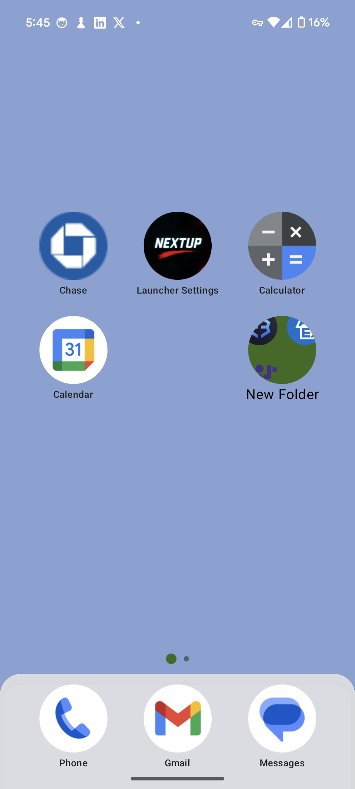
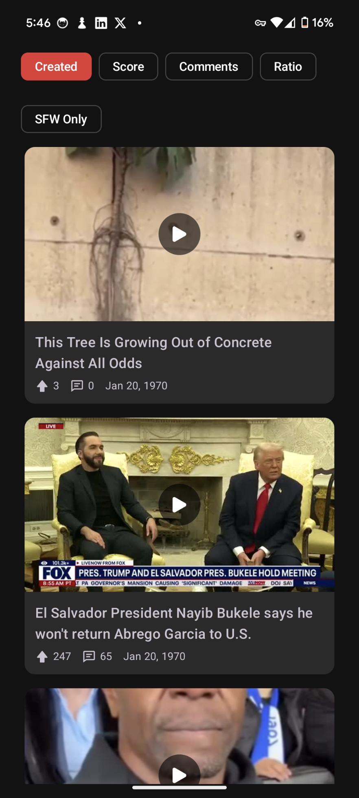
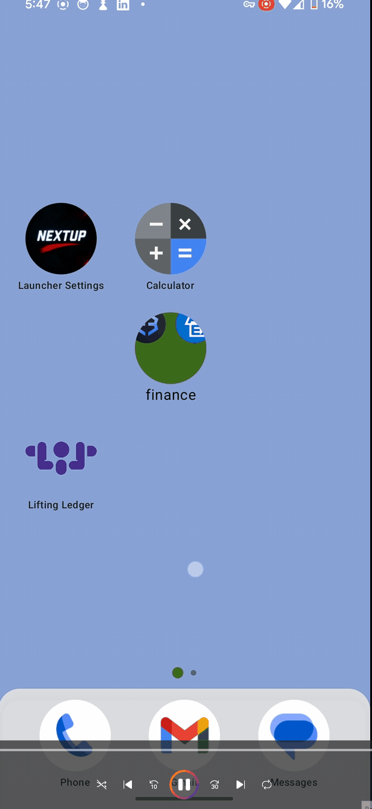

# 🚀 NextUp Launcher

A modern Android launcher built with Jetpack Compose and Kotlin, featuring real-time drag-and-drop, dynamic folder creation, and a content-rich right-swipe feed powered by Reddit. Designed with modularity, responsiveness, and developer scalability in mind.

---

## ✨ Features

- 🧲 **Real-Time Drag & Drop** — Smooth icon movement, hover zones, and snapping grid behavior  
- 🗃️ **Folders** — Create, rename, and manage folders inline with support for drag-in/out  
- 🔍 **Expandable App Drawer** — Swipe-up drawer with full app list, search, and gesture support  
- 🎥 **Content Feed** — Right-swipe reveals a customizable feed (currently Reddit videos with ExoPlayer)  
- 🎨 **Jetpack Compose UI** — Built fully in Compose with a modern Material3 theme  
- 🔁 **Persistent Layout** — App placements saved with DataStore + Protobuf  
- 📦 **MVVM + Event-Driven Architecture** — Clean separation of concerns for state and effect handling

---

## 📸 Previews

  
  

---
## 🎬 Demos

### Drag & Drop

### Folder Creation

### Folder Creation

---
## 🧰 Tech Stack

- **Language**: Kotlin (100%)  
- **UI**: Jetpack Compose + Material 3  
- **DI**: Hilt  
- **State**: StateFlow / SharedFlow  
- **Persistence**: DataStore (Protobuf)  
- **Media**: ExoPlayer  
- **Backend**: Firebase (Firestore + Functions)  
- **Architecture**: MVVM + Event-Driven State Management  
- **Build**: Gradle + KSP

---

## 🧪 Highlights of Implementation

### 🔁 Drag-and-Drop Architecture
- Uses `Modifier.pointerInput` with `detectDragGesturesAfterLongPress`
- Position tracking via `Offset` + dynamic highlight overlays
- Real-time folder merging and removal with visual cues

### 📁 Folder System
- Drop an icon onto another to create a folder
- Inline folder renaming
- App repositioning with duplicate prevention logic

### 🎬 Reddit Video Feed
- Cloud Function fetches top Reddit videos to Firestore
- Thumbnails generated via `ffmpeg` on Cloud Run
- Videos displayed using `ExoPlayer` in Compose UI

---

## 🚧 Roadmap

- [ ] Custom themes and icon packs  
- [ ] Additional content sources (YouTube, TikTok, etc.)  
- [ ] Long-press actions & widgets  
- [ ] Backup/export layouts  
- [ ] Animations polish (spring-based drag easing)

---

## 👨‍💻 Author

**Alec Dipasquale**  
Android Developer • 2+ years experience  
Open to roles or collaboration — [LinkedIn](https://www.linkedin.com/in/alecdipasquale/)
